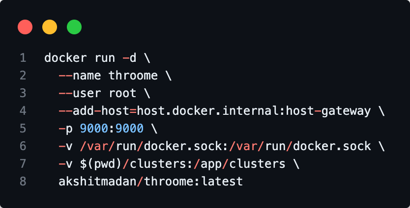

> A lightweight, open-source gateway for unified backend infrastructure access with Docker container provisioning.

Throome provides a single gateway layer to access multiple infrastructure components (Redis, PostgreSQL, Kafka) via cluster-based management. It eliminates direct integration complexity by providing unified SDKs and automatic service provisioning.

[](https://github.com/akmadan/throome/actions/workflows/test.yml)
[](https://github.com/akmadan/throome/actions/workflows/docker.yml)
[](https://go.dev/)
[](https://hub.docker.com/r/akshitmadan/throome)
[](LICENSE)
[](CONTRIBUTING.md)

### SDKs

[](https://www.npmjs.com/package/throome-sdk)
[](https://www.npmjs.com/package/throome-sdk)
[](https://pypi.org/project/throome-sdk/)
[](https://pypi.org/project/throome-sdk/)
[](https://pkg.go.dev/github.com/akmadan/throome/sdk/go)
[](https://goreportcard.com/report/github.com/akmadan/throome/sdk/go)



---

## What is Throome?

Throome is a gateway service that:

1. **Provisions Infrastructure**: Automatically spins up Docker containers for Redis, PostgreSQL, and Kafka
2. **Manages Clusters**: Groups related services into logical clusters with unique identifiers
3. **Routes Requests**: Handles connection pooling, health checks, and intelligent routing strategies
4. **Provides SDKs**: Offers unified SDKs (Go, Node.js/TypeScript, Python) for accessing all services
5. **Monitors Services**: Built-in health checks and metrics collection via Prometheus

### Core Capabilities

- **Docker Provisioning**: Automatically creates and manages Docker containers for services
- **Cluster Management**: Create, configure, and manage service clusters via Web UI or CLI
- **Smart Routing**: Multiple strategies (round-robin, weighted, least-connections)
- **Connection Pooling**: Efficient resource utilization across all services
- **Health Monitoring**: Continuous health checks with automatic failover
- **Metrics Collection**: Prometheus-compatible metrics endpoint

---

## Quick Start with Docker

### Prerequisites

- Docker Engine 20.10+ with Docker socket access
- Port 9000 available for Throome gateway
- Ports for your services (default: Redis 6379, PostgreSQL 5433, Kafka 9092)

### Pull and Run

```bash
docker run -d \
  --name throome \
  --user root \
  --add-host=host.docker.internal:host-gateway \
  -p 9000:9000 \
  -v /var/run/docker.sock:/var/run/docker.sock \
  -v $(pwd)/clusters:/app/clusters \
  akshitmadan/throome:latest
```

### Access Points

- **Web Dashboard**: http://localhost:9000
- **API Endpoint**: http://localhost:9000/api/v1
- **Health Check**: http://localhost:9000/api/v1/health
- **Metrics**: http://localhost:9000/metrics

### Container Configuration Explained

| Flag | Purpose |
|------|---------|
| `--user root` | Required for Docker socket access to provision containers |
| `--add-host=host.docker.internal:host-gateway` | Enables connectivity from Throome container to provisioned services |
| `-v /var/run/docker.sock:/var/run/docker.sock` | Grants Docker API access for container management |
| `-v $(pwd)/clusters:/app/clusters` | Persists cluster configurations on host |

---

## Local Development Setup

### Prerequisites

- Go 1.24+
- Node.js 18+ and npm
- Docker Engine 20.10+
- Make

### Clone and Build

```bash
# Clone repository
git clone https://github.com/akmadan/throome.git
cd throome

# Install Go dependencies
go mod download

# Build UI
cd ui && npm install && npm run build && cd ..

# Copy UI assets for Go embedding
mkdir -p pkg/gateway/ui
cp -r ui/dist pkg/gateway/ui/

# Build binaries
make build

# Run locally
./bin/throome --port 9000
```

### Makefile Targets

The Makefile provides automation for common development tasks:

**Build Targets**
- `make build`: Compiles `throome` gateway and `throome-cli` to `bin/` directory
- `make install`: Installs binaries to `$GOPATH/bin`
- `make clean`: Removes `bin/` and `build/` directories

**Testing Targets**
- `make test`: Runs all tests (unit + integration)
- `make test-unit`: Runs unit tests only
- `make test-integration`: Runs integration tests with Docker services
- `make test-coverage`: Generates coverage report
- `make test-race`: Detects race conditions
- `make test-setup`: Starts test infrastructure (via docker-compose)
- `make test-teardown`: Stops test infrastructure

**Development Targets**
- `make run`: Builds and runs Throome locally
- `make dev`: Runs in development mode with live reload

**Docker Targets**
- `make docker-test`: Runs tests in Docker environment
- `make docker-build`: Builds Docker image locally

---

## Project Structure

```
throome/
├── cmd/                    # Application entrypoints
│   ├── throome/           # Main gateway service
│   └── throome-cli/       # CLI tool for cluster management
├── pkg/                    # Public packages (importable by external projects)
│   ├── adapters/          # Infrastructure adapters (Redis, PostgreSQL, Kafka)
│   ├── cluster/           # Cluster configuration and management
│   ├── gateway/           # Core gateway logic and HTTP server
│   ├── monitor/           # Health checks and metrics collection
│   ├── provisioner/       # Docker container provisioning
│   ├── router/            # Request routing strategies
│   └── sdk/               # Go SDK for client applications
├── internal/               # Private packages (not importable externally)
│   ├── config/            # Application configuration structures
│   ├── logger/            # Structured logging (zap)
│   └── utils/             # Utility functions and validation
├── ui/                     # React + TypeScript frontend
│   ├── src/
│   │   ├── api/           # API client
│   │   ├── components/    # React components
│   │   └── pages/         # Page components
│   └── dist/              # Built UI assets (embedded in Go binary)
├── configs/                # Example configuration files
├── clusters/               # Cluster YAML configurations (generated at runtime)
├── deployments/            # Deployment configurations
│   └── docker/            # Dockerfile and docker-compose
├── test/                   # Integration test setup
│   └── docker-compose.yml # Test infrastructure services
├── docs/                   # Additional documentation
├── examples/               # Example applications
├── scripts/                # Utility scripts
└── .github/workflows/      # CI/CD pipelines
```

---

## Technical Architecture

### Components

**Gateway Service** (`pkg/gateway/`)
- HTTP server with embedded UI
- Cluster initialization and lifecycle management
- Service provisioning orchestration
- Router and adapter management

**Provisioner** (`pkg/provisioner/`)
- Docker API integration
- Container lifecycle management (create, start, stop, remove)
- Health check monitoring
- Service-specific image configuration

**Adapters** (`pkg/adapters/`)
- Service-specific connection handling
- Connection pooling per service type
- Health status reporting
- Standardized interface across all services

**Router** (`pkg/router/`)
- Request distribution strategies
- Load balancing algorithms
- Health-aware routing
- Service selection logic

**Monitor** (`pkg/monitor/`)
- Prometheus metrics collection
- Periodic health checks
- Service status aggregation
- Performance metrics

### Data Flow

1. **Cluster Creation**
   ```
   User → UI/CLI → API → Gateway → Provisioner → Docker
   Gateway creates cluster config → Initializes adapters → Starts health monitoring
   ```

2. **Service Request**
   ```
   Client → SDK → Gateway → Router → Adapter → Service
   Response flows back through same chain
   ```

3. **Health Monitoring**
   ```
   Monitor → Adapters → Services
   Status updates → Router (for routing decisions)
   Metrics → Prometheus endpoint
   ```

### Networking Model

- **Throome Gateway**: Runs in Docker, accessible on host port 9000
- **Provisioned Services**: Run in separate Docker containers on host network
- **Internal Communication**: Throome connects to services via `host.docker.internal`
- **External Access**: Services exposed on host ports (6379, 5433, 9092)

### Configuration Storage

Clusters are stored as YAML files in `clusters/<cluster-id>/config.yaml`:

```yaml
name: my-cluster
created_at: 2024-01-01T00:00:00Z
services:
  redis-1:
    type: redis
    host: host.docker.internal
    port: 6379
    container_id: abc123...
  postgres-1:
    type: postgres
    host: host.docker.internal
    port: 5433
    username: postgres
    password: password
    database: mydb
    container_id: def456...
```

---

## Scripts

The `scripts/` directory contains utility scripts for development and operations:

### `monitor-logs.sh`

**Purpose**: Real-time log monitoring for Throome Docker container

**Usage**:
```bash
./scripts/monitor-logs.sh
```

**What it does**:
- Follows logs from `throome-test` container
- Displays timestamps for each log entry
- Useful for debugging cluster creation and service provisioning

### `test-workflow.sh`

**Purpose**: Complete local workflow validation before commits

**Usage**:
```bash
./scripts/test-workflow.sh
```

**What it does**:
1. Builds UI assets (`npm run build`)
2. Copies UI to Go embedding location (`pkg/gateway/ui/dist`)
3. Downloads Go dependencies
4. Runs unit tests
5. Runs integration tests
6. Builds final binaries
7. Reports success/failure

**When to use**: Before pushing changes, especially when modifying UI or Go code together

---

## Development Workflow

See [CONTRIBUTING.md](CONTRIBUTING.md) for detailed contribution guidelines, including:
- UI development and testing workflow
- Go backend development
- Running tests locally
- Submitting pull requests

---

## API Reference

### Health Check

```bash
GET /api/v1/health
```

Response:
```json
{
  "status": "healthy",
  "timestamp": 1234567890
}
```

### List Clusters

```bash
GET /api/v1/clusters
```

Response:
```json
{
  "clusters": [
    {
      "id": "abc123",
      "name": "my-cluster",
      "created_at": "2024-01-01T00:00:00Z",
      "services": [
        {
          "name": "redis-1",
          "type": "redis",
          "host": "host.docker.internal",
          "port": 6379,
          "status": "HEALTHY"
        }
      ]
    }
  ],
  "count": 1
}
```

### Create Cluster

```bash
POST /api/v1/clusters
Content-Type: application/json

{
  "name": "my-cluster",
  "config": {
    "services": {
      "redis-1": {
        "type": "redis",
        "host": "localhost",
        "port": 6379
      }
    }
  }
}
```

### Delete Cluster

```bash
DELETE /api/v1/clusters/{cluster_id}
```

**Note**: Deleting a cluster also stops and removes all provisioned Docker containers.

---

## SDKs

Throome provides official SDKs for Go, Node.js/TypeScript, and Python with comprehensive API coverage including cluster management, service monitoring, activity logging, and direct data access.

### Go SDK

**Installation**

```bash
go get github.com/akmadan/throome/sdk/go
```

**Quick Example**

```go
package main

import (
    "context"
    "log"
    
    throome "github.com/akmadan/throome/sdk/go"
)

func main() {
    // Initialize client
    client := throome.NewClient("http://localhost:9000")
    ctx := context.Background()

    // Create a cluster
    createResp, err := client.CreateCluster(ctx, throome.CreateClusterRequest{
        Name: "my-cluster",
        Services: map[string]throome.ServiceConfig{
            "redis-1": {Type: "redis", Port: 6379},
            "postgres-1": {Type: "postgres", Port: 5432, Database: "mydb"},
        },
    })
    if err != nil {
        log.Fatal(err)
    }

    // Work with cluster
    cluster := client.Cluster(createResp.ClusterID)
    
    // Cache operations
    cache := cluster.Cache()
    cache.Set(ctx, "user:123", "John Doe", 60*time.Second)
    value, _ := cache.Get(ctx, "user:123")
    
    // Database operations
    db := cluster.DB()
    db.Execute(ctx, "CREATE TABLE users (id SERIAL, name VARCHAR(100))")
    rows, _ := db.Query(ctx, "SELECT * FROM users")
    
    // Get service logs
    logs, _ := cluster.Service("redis-1").GetLogs(ctx, throome.LogOptions{Tail: 100})
}
```

[Full Go SDK Documentation →](sdk/go/README.md) | [Examples →](sdk/go/examples/)

### Node.js/TypeScript SDK

**Installation**

```bash
npm install throome-sdk
```

**Quick Example**

```typescript
import { ThroomClient, ServiceConfig } from 'throome-sdk';

const client = new ThroomClient({ baseURL: 'http://localhost:9000' });

async function main() {
  // Create a cluster
  const services: Record<string, ServiceConfig> = {
    'redis-1': { type: 'redis', port: 6379 },
    'postgres-1': { type: 'postgres', port: 5432, database: 'mydb' },
  };

  const createResp = await client.createCluster({
    name: 'my-cluster',
    services,
  });

  // Work with cluster
  const cluster = client.cluster(createResp.cluster_id);

  // Cache operations
  const cache = cluster.cache();
  await cache.set('user:123', 'John Doe', { expiration: 60 });
  const value = await cache.get('user:123');

  // Database operations
  const db = cluster.db();
  await db.execute('CREATE TABLE users (id SERIAL, name VARCHAR(100))');
  const rows = await db.query('SELECT * FROM users');

  // Get service logs
  const logs = await cluster.service('redis-1').getLogs({ tail: 100 });
}

main().catch(console.error);
```

[Full Node.js SDK Documentation →](sdk/nodejs/README.md) | [Examples →](sdk/nodejs/examples/)

### Python SDK

**Installation**

```bash
pip install throome-sdk
```

**Quick Example**

```python
from throome import ThroomClient, ServiceConfig

client = ThroomClient(base_url="http://localhost:9000")

# Create a cluster
services = {
    "redis-1": ServiceConfig(type="redis", port=6379),
    "postgres-1": ServiceConfig(type="postgres", port=5432, database="mydb"),
}

create_resp = client.create_cluster(name="my-cluster", services=services)

# Work with cluster
cluster = client.cluster(create_resp.cluster_id)

# Cache operations
cache = cluster.cache()
cache.set("user:123", "John Doe", expiration=60)
value = cache.get("user:123")

# Database operations
db = cluster.db()
db.execute("CREATE TABLE users (id SERIAL, name VARCHAR(100))")
rows = db.query("SELECT * FROM users")

# Get service logs
logs = cluster.service("redis-1").get_logs(options=LogOptions(tail=100))
```

[Full Python SDK Documentation →](sdk/python/README.md) | [Examples →](sdk/python/examples/)

### SDK Features

All SDKs support:

- **Cluster Management**: Create, list, get, and delete clusters
- **Health Monitoring**: Check gateway and cluster health status
- **Activity Logging**: View detailed logs of all service interactions
- **Service Operations**: Get service info and Docker container logs
- **Database Client**: Execute SQL queries and transactions
- **Cache Client**: Redis operations (GET, SET, DELETE, TTL)
- **Queue Client**: Publish messages to Kafka topics
- **Type Safety**: Full type definitions (Go, TypeScript, Python type hints)

---

## Troubleshooting

### Docker Socket Permission Denied

**Error**: `permission denied while trying to connect to the Docker daemon socket`

**Solution**: Ensure container runs as root with `--user root` flag

### Port Already in Use

**Error**: `bind: address already in use`

**Solution**: 
- Change service ports in UI (e.g., PostgreSQL from 5432 to 5433)
- Stop conflicting services on host
- Check with `lsof -i :<port>`

### Container Not Connecting

**Error**: `dial tcp [::1]:6379: connect: connection refused`

**Solution**: Verify `--add-host=host.docker.internal:host-gateway` is set

### Frontend Timeout

**Error**: Cluster creation times out

**Solution**: Frontend timeout is set to 120s to accommodate image pulls. Large images may take longer on slow connections.

---

## Performance Tuning

### Connection Pool Configuration

Edit cluster YAML files to adjust pool settings:

```yaml
services:
  redis-1:
    pool:
      min_connections: 5
      max_connections: 100
      max_idle_time: 300
```

### Health Check Intervals

Configure in `configs/throome.yaml`:

```yaml
monitoring:
  enabled: true
  collection_interval: 10  # seconds
```

---

## Metrics

Throome exposes Prometheus-compatible metrics at `/metrics`:

- `throome_cluster_total`: Total number of clusters
- `throome_service_health`: Health status per service (0=unhealthy, 1=healthy)
- `throome_request_duration_seconds`: Request duration histogram
- `throome_active_connections`: Current active connections per service

---

## License

Licensed under the Apache License 2.0. See [LICENSE](LICENSE) for details.

---

## Support

- Documentation: [docs/](docs/)
- Issues: [GitHub Issues](https://github.com/akmadan/throome/issues)
- Discussions: [GitHub Discussions](https://github.com/akmadan/throome/discussions)
- Changelog: [CHANGELOG.md](CHANGELOG.md)
- Contributing: [CONTRIBUTING.md](CONTRIBUTING.md)
- SDK Publishing: [SDK_PUBLISHING.md](SDK_PUBLISHING.md)
